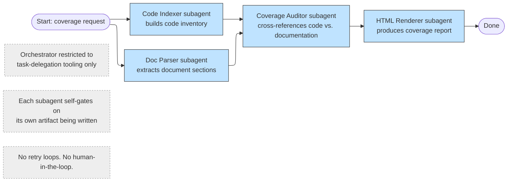
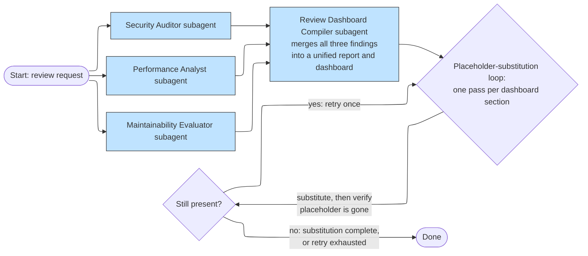
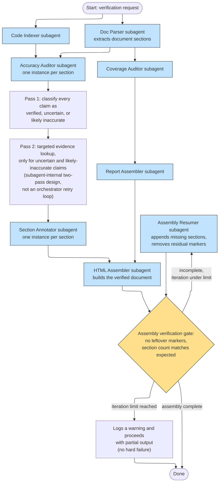
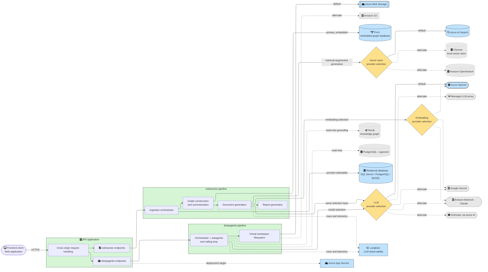

# Pipeline Architecture — deepagents vs codesense

Structural diagrams for the two documentation-generation pipeline families in this repo:

- **deepagents** — agentic pipeline: an orchestrator LLM coordinating specialized subagents through a tool-calling loop
- **codesense** — procedural pipeline: direct sequential/parallel LLM invocations with no tool-calling loop

Every subagent, retry loop, gate/verification check, and human-in-the-loop (HITL) point identified in the implementation is represented below.

---

## 1. deepagents

Four independent agent graphs. Each has one orchestrator LLM (with a restricted toolset) that dispatches to named subagents.

### 1.1 Documentation Generation Pipeline

```mermaid
---
config:
  layout: elk
---

flowchart TD
    START(["Start: documentation request"]) --> MODE{"Mode decision:\ndoes a generation plan already exist?"}

    MODE -->|"Modification mode"| MOD1["Doc Editor subagent\nedit existing document"]
    MOD1 --> MOD1B["Doc Formatter subagent\nclean-first pass"]
    MOD1B --> MOD2["Quality Checker subagent\nre-review"]
    MOD2 --> MODQ{"Quality gate"}
    MODQ -->|"low score"| MOD1
    MODQ -->|"acceptable"| MOD3["Scorecard update\nUI-only, no-op"]
    MOD3 --> MOD3B["Orchestrator updates\nshared memory notes"]
    MOD3B --> MODDONE(["Confirmation / done"])

    MODE -->|"New generation or resume"| STEP2["Code Analyzer subagent\nproduces code analysis artifact"]
    STEP2 --> GATE_CA{"Completion gate:\nanalysis artifact exists\nand passes verification"}
    GATE_CA -->|"fail"| STEP2

    GATE_CA -->|"pass"| STEPB["Orchestrator writes\ngeneration plan and instructions"]

    STEPB --> HITL{{"HUMAN-IN-THE-LOOP\nplan approval checkpoint\nexecution pauses for reviewer"}}
    HITL -->|"resumed by reviewer\n(approved or edited)"| REREAD["Orchestrator re-reads the\npossibly edited generation plan"]
    HITL -->|"skipped in modification mode\nor true resume"| STEP3B
    REREAD --> STEP3B["Orchestrator scaffolds the\noutput document shell"]

    STEP3B --> STEP4["Doc Writer subagent\nsingle call, all sections"]

    STEP4 --> GATE4B{"Section completeness gate:\nis every planned section\npresent and non-empty?"}
    GATE4B -->|"missing sections,\nattempts under limit"| STEP4RETRY["Doc Writer subagent\nre-run for missing sections only"]
    STEP4RETRY --> GATE4B
    GATE4B -->|"complete, or\nretry limit reached"| STEP6

    STEP6["Orchestrator assembles document,\nbuilds table of contents,\nmarks generation complete"]
    STEP6 --> STEP6C["Structural consistency check:\nduplicate headings,\nunbalanced diagram blocks"]

    STEP6C --> GATE75{"Assembly verification gate\n(distinct from section-completeness gate):\ndoes every planned section exist\nin the assembled document?"}
    GATE75 -->|"still missing,\nretries under limit"| STEP4RETRY2["Doc Writer subagent for missing\nsections, spliced into place,\nfollowed by structural re-check"]
    STEP4RETRY2 --> GATE75
    GATE75 -->|"complete, or\nretry limit reached, proceed anyway"| GATEARTIFACT["Orchestrator records a\ngate-check artifact\nwith retry count and gaps"]

    GATEARTIFACT --> STEP8["Quality Checker subagent\nproduces quality review artifact"]

    STEP8 --> GATE84{"Quality artifact validation gate:\nwell-formed scores,\nvalid status values?"}
    GATE84 -->|"malformed, first failure"| STEP8RETRY["Quality Checker subagent\nsingle corrective retry"]
    STEP8RETRY --> GATE84
    GATE84 -->|"still malformed"| STUB["Orchestrator records a failed\nquality status and skips the\nlow-score remediation loop"]
    GATE84 -->|"valid"| GATE85

    GATE85{"Low-score remediation gate:\nany section scored below\nacceptance threshold?"}
    GATE85 -->|"weak sections found,\ncycles under limit"| REWRITE["Doc Writer subagent rewrites\nweak sections with reviewer notes,\nfollowed by structural re-check\nand re-review"]
    REWRITE --> GATE85
    GATE85 -->|"acceptable, or cycle\nlimit reached\n(modification mode uses its\nown quality gate instead)"| STEP8B
    STUB --> STEP8B

    STEP8B["Doc Formatter subagent\nfinal cleanup pass"]
    STEP8B --> STEP10B["Orchestrator updates shared\nmemory with low-score feedback\nfor future runs"]
    STEP10B --> DONE(["Documentation complete"])

    classDef hitl fill:#f96,stroke:#333,stroke-width:2px
    classDef gate fill:#ffe08a,stroke:#333
    classDef subagent fill:#bfe3ff,stroke:#333
    class HITL hitl
    class GATE_CA,GATE4B,GATE75,GATE84,GATE85 gate
    class STEP2,STEP4,STEP4RETRY,STEP4RETRY2,STEP8,STEP8RETRY,REWRITE,STEP8B,MOD1,MOD1B,MOD2 subagent
```

**Four distinct, non-interchangeable retry mechanisms:**
| Gate | Detects | Cap |
|---|---|---|
| Section completeness | Planned section missing/empty right after generation | 3 attempts |
| Assembly verification | Section missing from the assembled document post-splice | 2 retries (on top of the 3 above) |
| Quality artifact validation | Malformed or incomplete review output | 1 corrective retry |
| Low-score remediation | Section present but scored below acceptance threshold | 2 cycles |

**HITL**: exactly one pause point — a plan-approval checkpoint that suspends execution until a reviewer responds. Skipped in modification mode and on true resume. No explicit rejection branch is modeled; any response resumes the orchestrator, which simply re-reads the (potentially reviewer-edited) plan.

---

### 1.2 Coverage Analysis Pipeline

---

### 1.3 Code Review Pipeline

**HITL**: none. **Gates**: a single per-section substitute-and-verify retry (max one retry per section).

---

### 1.4 Verification Pipeline

**HITL**: none — the orchestrator in this pipeline has no reviewer-facing tool. **Loop**: assembly verification ↔ assembly resumption, capped at **3 iterations**, with progress tracked in a per-iteration status artifact.

---

## 2. codesense

No agent framework and no tool-calling loop — a procedural fan-out from a single ingestion stage into direct, sequential LLM invocations.

```mermaid
---
config:
  layout: elk
---

flowchart TD
    START(["Start: repository ingestion request"]) --> ING["Ingestion orchestrator\ndrives static analysis,\ngraph construction, and\nreport generation directly"]

    ING --> ANALYZERS["Language-specific static analyzers\n(non-LLM parsing, ~20 languages)"]
    ING --> GRAPHBUILD["Graph builder\nconstructs the code knowledge graph"]

    GRAPHBUILD --> SUMM["Hierarchical summarizers:\nsubsystem detection,\nentry-point detection,\nnode-level LLM summarization"]
    GRAPHBUILD --> CHATPROMPT["Per-language system prompt\nselection for interactive Q&A"]
    CHATPROMPT --> AISUMMARY["Interactive node chat:\nsingle system + user message,\nno output schema,\nno citation requirement,\nno length bound"]

    ING -.->|"handed off via persisted\nartifacts and stores only —\nno direct in-process coupling"| DOCGEN

    subgraph DOCGEN["Document Generation — BRD and TSD (symmetric)"]
        direction TB

        subgraph TEMPLATE["Legacy-modernization template generator\n(separate feature from section generation)"]
            direction TB
            BRDP0["BRD Pass 0: parallel discovery\nentry point"] --> BRDP35["BRD Pass 3.5: classify\nmodernization route"]
            BRDP35 --> BRDP1["BRD Pass 1: detect\nbusiness workflows"]
            BRDP1 --> BRDP2["BRD Pass 2: detect\nbusiness rules and approvals"]
            BRDP2 --> BRDP3["BRD Pass 3: identify interfaces,\nintegrations, and stakeholders\n(falls back to heuristic parsing\non malformed output)"]
            BRDP3 --> BRDP4["BRD Pass 4: generate template\n(structured-output attempt,\nplain-text fallback)"]

            TSDP1["TSD Pass 1: detect outdated\ntechnology and frameworks"] --> TSDP2["TSD Pass 2: detect\noverly coupled components"]
            TSDP2 --> TSDP3["TSD Pass 3: track technical risk\n(hardcoded values, global state,\nfallback parsing on failure)"]
            TSDP3 --> TSDP4["TSD Pass 4: generate template\n(structured-then-fallback)"]
        end

        BRDP4 --> SECTIONGEN
        TSDP4 --> SECTIONGEN

        subgraph SECTIONGEN["Per-section generation and validation\n(executes once per section)"]
            direction TB
            GEN["Generate section content against\nshared formatting rules and a\ndomain-specific template outline"] --> VPASS1

            VPASS1["Pass 1: completeness analysis\nidentifies required elements"]
            VPASS1 --> VPASS2["Pass 2: validation scoring\n(completeness, correctness,\nconciseness; deterministic\ntemperature)"]

            VPASS2 --> GATEGAP{"Completeness or correctness\nbelow acceptance threshold?"}
            GATEGAP -->|"no, thresholds met"| VPASS4
            GATEGAP -->|"yes"| GAPINNER{"Internal early-exit check:\nscores already good enough?"}
            GAPINNER -->|"yes, skip"| VPASS4
            GAPINNER -->|"no"| GAPFILL["Pass 3: targeted gap-fill rewrite\n(runs at most once —\nno iterative loop,\nno retry counter)"]
            GAPFILL --> REVAL["Single re-validation call\nto log post-gap-fill scores\n(not looped even if still low)"]
            REVAL --> VPASS4

            VPASS4["Pass 4: final completeness check"]
            VPASS4 --> GATEFINAL{"Final scores still\nbelow threshold?"}
            GATEFINAL -->|"yes"| WARNONLY["Logs a warning recommending\nmanual review — no further\nregeneration, no loop,\nno escalation"]
            GATEFINAL -->|"no"| SECDONE(["Section accepted"])
            WARNONLY --> SECDONE
        end

        SECDONE --> REPORTGEN
    end

    REPORTGEN["Report generation:\nHTML and diagram post-processing\nagainst a shared formatting contract"]

    REPORTGEN -.->|"externally triggered by a human\nreviewer only — not part of the\nautomated pipeline, no internal loop"| FEEDBACK

    subgraph FEEDBACK["Section feedback — single-shot per submission"]
        direction TB
        CLASSIFY["Classify feedback:\nin-place edit vs. retrieval-\nassisted regeneration"]
        CLASSIFY -->|"in-place"| INPLACE["Single rewrite call"]
        CLASSIFY -->|"retrieval-assisted"| RETRIEVE["Generate targeted queries,\nretrieve and de-duplicate\nsupporting context,\nanalyze the content gap,\napply one of several\nregeneration strategies"]
        INPLACE --> SCORE["Score the output and\npersist the revised section"]
        RETRIEVE --> SCORE
    end

    classDef gate fill:#ffe08a,stroke:#333
    classDef warn fill:#f7c6c6,stroke:#333
    classDef llmcall fill:#bfe3ff,stroke:#333
    class GATEGAP,GAPINNER,GATEFINAL gate
    class WARNONLY warn
    class GEN,VPASS1,VPASS2,GAPFILL,REVAL,VPASS4,CLASSIFY,INPLACE,RETRIEVE,SCORE,BRDP0,BRDP35,BRDP1,BRDP2,BRDP3,BRDP4,TSDP1,TSDP2,TSDP3,TSDP4 llmcall
```

**HITL**: not found anywhere in this pipeline — no interrupt/pause mechanism exists in the implementation. Business-domain terms such as "approval" appear only as content the model is asked to look for in source code, never as a pipeline checkpoint.

**Loop shape**: every "loop" here is a fixed, single-shot pass sequence with at most one conditional extra LLM call (gap-fill) — never an iterative retry with a counter. A threshold miss at the final gate produces only a logged warning, not a retry or escalation.

**Stage coupling**: not a strict pipe. Ingestion directly drives both graph construction and report generation; document generation consumes ingestion/graph output only through persisted artifacts, with no direct coupling back into ingestion or graph stages. Report generation has a one-way, read-only dependency on ingestion's data models (not a re-ingestion trigger). No stage automatically loops back into an earlier stage.

---

## 3. Side-by-side summary

| Aspect | deepagents | codesense |
|---|---|---|
| Control flow | Agentic orchestrator + tool-calling loop | Procedural fan-out, direct sequential LLM calls |
| Sub-pipelines | 4 (documentation, coverage, review, verification), each its own graph | 1 fan-out (ingestion → graph → document generation → report generation) + an independent section-feedback entry point |
| HITL | Yes — one plan-approval checkpoint per documentation run, skippable in modification/resume modes | None found anywhere |
| Iterative retry loops | 4 distinct, bounded loops in documentation generation + 1 in verification (max 3) + 1 in review (max 1) | 1 conditional single-shot gap-fill per section — no true iterative loop anywhere |
| Failure handling on cap reached | Explicit: records a gate-check or failed-quality artifact, tells downstream steps how to interpret partial state | Implicit: logs a warning only, ships the document as-is |
| Cross-stage feedback | None — each sub-pipeline is linear/parallel-then-converge, no stage re-triggers an earlier stage | None — the main flow is one-directional; section feedback is externally triggered per human edit, not internally looped |

---

## 4. System / Infrastructure Architecture

External services both pipelines connect to. Dashed edges denote an alternate/pluggable provider (only one active at a time, selected by configuration); solid edges denote the default/primary path.

**Notes**
- No message queue or cache layer was found in either pipeline — concurrency is handled through an in-process worker pool.
- No authentication layer was found in the inspected routing code — only cross-origin request handling; an auth layer may exist elsewhere but was not located.
- The Neo4j/pgvector knowledge-graph path is deepagents-only, read-only, and scoped to a single pre-built dataset.
- Kuzu is codesense's primary graph database — embedded and file-based, with no separate database server.
- Every LLM, embedding, and vector-store provider is selected at runtime by configuration — only one branch of each dashed fan-out is active per deployment.

---

